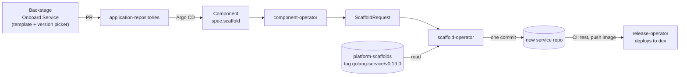

# platform-scaffolds

Versioned templates for new service repositories. When a service is onboarded,
the platform creates its GitHub repository and renders one of these templates
into it as a single commit. The result already builds, ships and shows up in
monitoring and the developer portal.

```
scaffold.yaml + template/ + parameters  →  a working service repository
```

This repo only defines what a new repository looks like.
[scaffold-operator](https://github.com/entr0pian/scaffold-operator) renders it.

## Where it fits



Backstage's version picker lists this repo's release tags and defaults to the
newest. [component-operator](https://github.com/entr0pian/component-operator)
copies the chosen template and version into a `ScaffoldRequest`, and
scaffold-operator records the exact commit it rendered from.

## `golang-service`

The one template today. A rendered repository contains:

| Area | What you get |
|---|---|
| Service | Go HTTP server: `/` landing page (HTML for browsers, a JSON endpoint index otherwise), `/healthz`, `/readyz`, JSON logs with a per-request access log |
| Metrics | `/metrics` with Go runtime, process, HTTP request count/latency (bounded `route` label) and DB pool metrics |
| Helm chart | 2-replica Deployment with startup/readiness/liveness probes and default requests/limits, PodDisruptionBudget, Service, public HTTPS Ingress at `<component>.<env>.gerodimos.dev`, ServiceMonitor, and an ExternalSecret for a database binding when a `Release` enables one |
| CI | Go build/test, `helm lint` and helm-unittest, then an image pushed to `ghcr.io/<owner>/<repo>:<sha>` |
| Database schema | `migrations/` (SQL files + `atlas.sum`, applied by Atlas) and a `schema` workflow that validates them on Postgres 16 and publishes `ghcr.io/<owner>/<repo>/schema:0.0.0-g<sha>`, the platform's `database-schema` chart with the migrations inside. Released separately from the code |
| Catalog | `catalog-info.yaml`, so Backstage discovers the service |

The platform contract is built in. The chart labels every workload with
`platform.taskapp.io/{component,environment}`, which Argo CD passes in. The
ServiceMonitor turns those into `component`/`environment` metric labels, so
platform dashboards and Backstage's Metrics tab pick the service up with no
per-service setup.

## Layout and parameters

```
templates/<template>/
├── scaffold.yaml   # name, version, required parameters
└── template/       # files rendered into the new repository
```

`golang-service` takes four parameters:

| Parameter | Used for |
|---|---|
| `componentName` | Binary, chart and Kubernetes resource names |
| `repositoryName` | Go module path `github.com/<owner>/<repositoryName>`, default image repository |
| `owner` | GitHub account of the repository (module path, image repository) |
| `componentOwner` | The owning team, written to `catalog-info.yaml` |

Adding a template means adding a `templates/<name>/` directory. Nothing else
in the repo changes.

## Templating

Rendering is deliberately simple:

- Only files ending in `.tpl` are rendered, and the suffix is dropped
  (`go.mod.tpl` → `go.mod`).
- Only exact `{{ parameterName }}` placeholders for declared parameters are
  replaced. Everything else is copied byte for byte.

That second rule is what lets Helm templates (`{{ .Values.image.tag }}`) and
GitHub Actions expressions (`${{ github.repository }}`) live in the template
untouched: they belong to engines that run later. The CI workflow has no
placeholders at all and derives its image name from the repository at run
time. The schema workflow works the same way, and pins the platform's
`database-schema` chart by its tag in `helm-charts`.

## Versioning

Each template is versioned on its own with SemVer, as an immutable tag
`<template>/v<version>` (for example `golang-service/v0.12.0`). `main` holds the
latest source, and there are no per-version directories. On every tag,
`release.yaml` fails unless `scaffold.yaml`'s `version` matches the tag.

Scaffolding happens **once**. After the first commit the service team owns the
repository, and nothing re-applies a template to it. Moving an existing
service to a newer template version is an ordinary pull request in that
service's repository.

## Testing a change

`scripts/render.py` renders a template the same way scaffold-operator does,
so a change can be tried on a real generated repository before it's tagged:

```sh
scripts/render.py golang-service /tmp/orders \
  componentName=orders repositoryName=orders owner=entr0pian componentOwner=team-a
cd /tmp/orders
go test ./...
helm lint chart && helm unittest chart
docker build -t orders .
```
